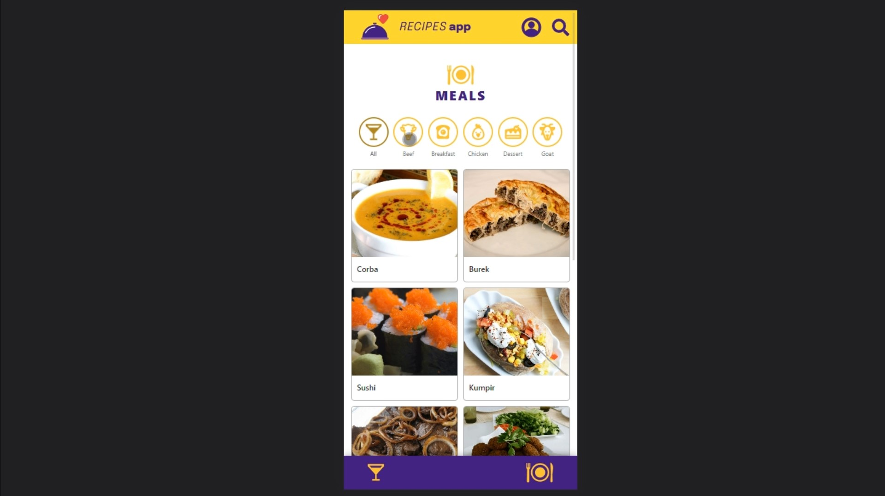

# Recipes App

Este é um projeto de um aplicativo de receitas que foi desenvolvido utilizando as seguintes tecnologias: React, React Router, Redux, Jest e React Testing Library.



## Como executar o projeto

Para executar o projeto em sua máquina local, siga os passos abaixo:

1. Certifique-se de que você tem o Node.js (versão 16 ou 18) instalado em seu sistema. Caso não tenha, você pode baixá-lo e instalá-lo a partir do site oficial: [Node.js](https://nodejs.org/)

2. Faça o clone deste repositório em um diretório de sua preferência utilizando o seguinte comando:

```
git clone git@github.com:albertoflorence/recipes-app.git
```

3. Navegue até o diretório do projeto:

```
cd recipes-app
```

4. Instale as dependências necessárias executando o seguinte comando:

```
npm install
```

5. Com todas as dependências instaladas, agora você pode iniciar o aplicativo usando o seguinte comando:

```
npm start
```

O aplicativo será iniciado em modo de desenvolvimento e estará acessível em [http://localhost:3000](http://localhost:3000).

## Como executar os testes

O projeto utiliza o Jest e o React Testing Library para os testes. Para executar os testes, você pode usar o seguinte comando:

```
npm test
```

Isso iniciará a execução dos testes automatizados e você verá os resultados no console.

## Estrutura do projeto

Aqui está uma breve visão geral da estrutura de pastas do projeto:

```
recipes-app/
  ├── src/
  │   ├── components/
  │   ├── images/
  │   ├── pages/
  │   ├── redux/
  │   ├── services/
  │   ├── tests/
  │   ├── utils/
  │   ├── App.jsx
  │   ├── index.js
  │   └── ...
  ├── public/
  │   ├── index.html
  │   └── ...
  ├── package.json
  ├── README.md
  └── ...
```

- A pasta `src` contém todos os arquivos do código-fonte do aplicativo.
- `components` e `pages` contêm os componentes React utilizados no aplicativo.
- `reducers` e `actions` contêm o gerenciamento de estado através do Redux.
- `utils` contém funções auxiliares utilizadas no projeto.
- `App.js` é o componente raiz do aplicativo que controla o roteamento e a estrutura geral da aplicação.
- `index.js` é o ponto de entrada do aplicativo, onde ele é renderizado na página HTML.
- A pasta `public` contém arquivos estáticos, como o arquivo index.html, que é a página base do aplicativo.

Sinta-se à vontade para explorar e modificar o código conforme suas necessidades.
